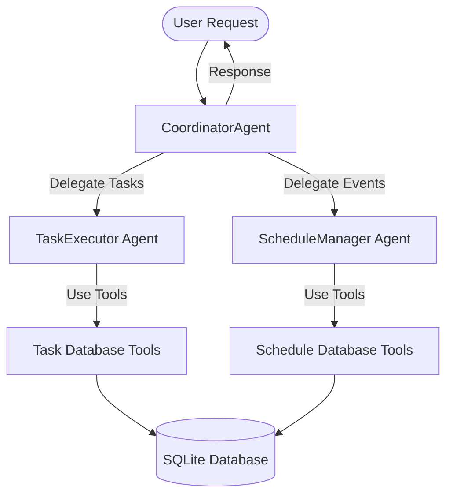

# AI Agents Orchestration Package

The `backend/app/agents/` directory holds the implementation of the **Multi-Agent System** that powers the personal assistant. The system uses a hierarchical coordinator-specialist pattern to delegate tasks and orchestrate tool operations.

## Architecture & Communication Flow

## File-by-File Breakdown

### 🤖 Core Agent Definitions
*   [ai_agent.py](file:///c:/genai_apac/study_projects/GenAI-TaskMaster/backend/app/agents/ai_agent.py): The base class `AIAgent` that wraps interactions with the Google Gemini API. Key responsibilities:
    *   **Gemini Client Initialization**: Configures API keys, model parameters (defaults to `gemini-1.5-flash`), temperature, and system instruction.
    *   **Context & History Management**: Formats history logs, tracking conversational exchanges.
    *   **Tool Registration**: Binds custom Python functions to the Gemini model instance, allowing the model to decide when and which tools to call.
*   [coordinator.py](file:///c:/genai_apac/study_projects/GenAI-TaskMaster/backend/app/agents/coordinator.py): Implements `CoordinatorAgent`. Acts as the central dispatcher:
    *   **Request Classification**: Inspects input user requests to determine if they relate to tasks, calendar schedules, note summaries, or complex multi-step routines.
    *   **Collaboration Loop**: Dynamically boots specialist agents (`TaskExecutor`, `ScheduleManager`) to resolve domain-specific prompts.
    *   **Action Orchestration**: Synthesizes the sub-agent responses into a single cohesive response, coordinating back-to-back database updates if required.
*   [task_executor.py](file:///c:/genai_apac/study_projects/GenAI-TaskMaster/backend/app/agents/task_executor.py): Implements `TaskExecutor`. A specialist agent configured with `system_instruction` optimized for parsing task titles, priorities, descriptions, and performing CRUD actions via task database tools.
*   [schedule_manager.py](file:///c:/genai_apac/study_projects/GenAI-TaskMaster/backend/app/agents/schedule_manager.py): Implements `ScheduleManager`. A specialist agent focused on calendar scheduling. Interprets natural language timestamps (e.g., "next Tuesday at 2 PM") and executes database tools to record, delete, or fetch schedule entries.
*   [\_\_init\_\_.py](file:///c:/genai_apac/study_projects/GenAI-TaskMaster/backend/app/agents/__init__.py): Exposes agent classes (`CoordinatorAgent`, `AIAgent`, `TaskExecutor`, `ScheduleManager`) for clean module-level importing.

## Orchestration Execution Sequence

1.  **Incoming Request**: FastAPI routes a user request string (from chat or automation trigger) to the `CoordinatorAgent`.
2.  **Intent Parsing**: Coordinator uses Gemini to assess the intent. If it requires task management, it calls `TaskExecutor`. If it requires calendar adjustments, it calls `ScheduleManager`.
3.  **Specialist Action**: The specialist agent evaluates the query. If a database modification is needed, the agent generates a **Tool Call** request containing specific arguments (e.g., title, start time).
4.  **Tool Execution**: The server intercepts the Tool Call request, runs the corresponding Python database function locally, and returns the result back to the agent.
5.  **Final Synthesis**: The specialist returns its final message to the Coordinator, who aggregates the information and delivers a final user response.
